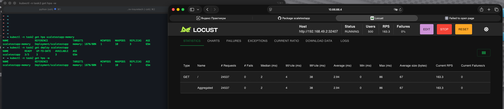
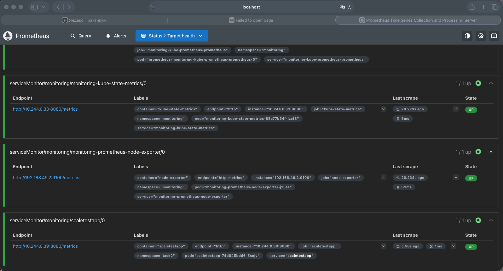
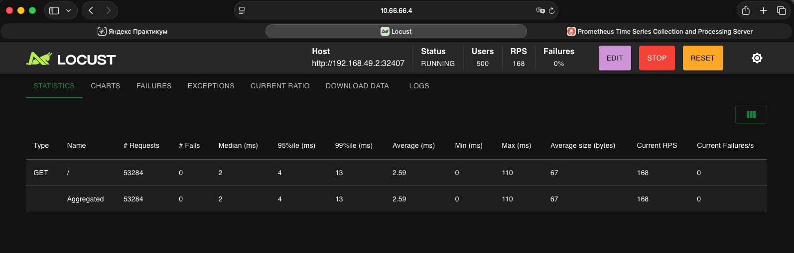
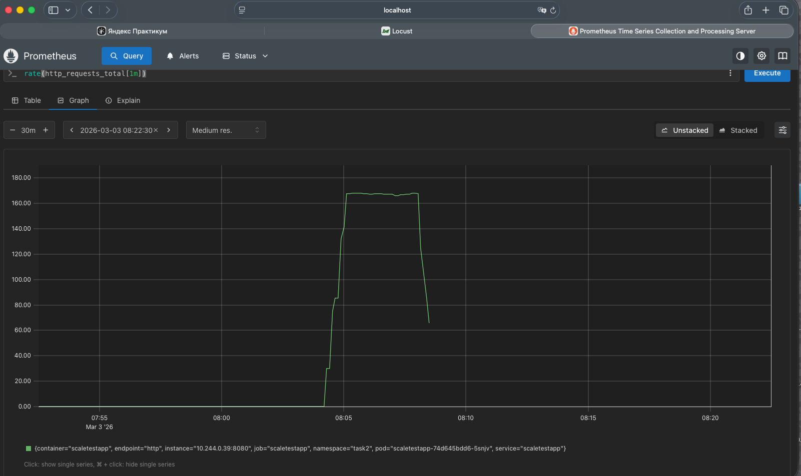
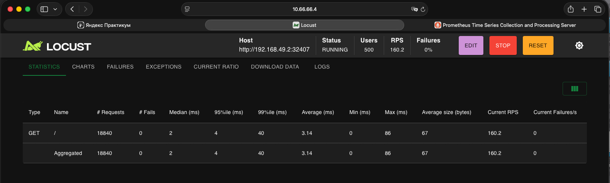
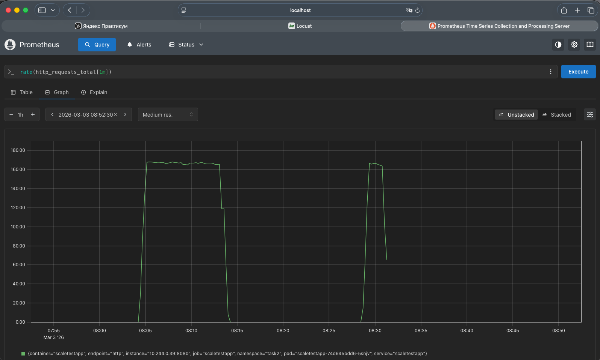
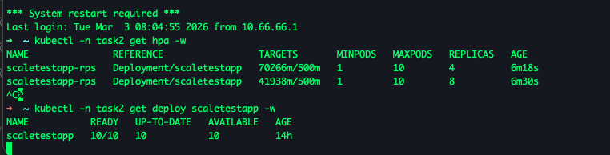

# Task2 — Динамическое масштабирование контейнеров (Minikube) + Kustomize

Все ресурсы приложения применяются одной командой через **kustomize**.
Namespace для приложения: `task2`.

> Важно: объекты мониторинга (Prometheus/Adapter) ставятся через Helm в `monitoring` namespace,
> поэтому они не включены в kustomize-бандл приложения.

---

## Part 1 — HPA по памяти

### 0) Minikube + metrics-server
```bash
minikube start
minikube addons enable metrics-server
```

### 1) Применить приложение (Deployment+Service+HPA)
Из корня репозитория:
```bash
kubectl apply -k Task2
```

Проверки:
```bash
kubectl -n task2 get pods -w
kubectl -n task2 get hpa -w
```

URL сервиса:
```bash
minikube service scaletestapp -n task2 --url
```

### 2) Нагрузка (Locust)
```bash
pip install locust
python -m locust  
```
UI: http://localhost:8089

В поле **Host** - URL из команды `minikube service ... --url`.  



---

## Part 2 — HPA по RPS (Prometheus + Adapter)

### 0) Перед Part2: удалить HPA по памяти
```bash
kubectl -n task2 delete hpa scaletestapp-memory
```

### 1) Установить kube-prometheus-stack
```bash
helm repo add prometheus-community https://prometheus-community.github.io/helm-charts
helm repo update

helm install monitoring prometheus-community/kube-prometheus-stack -n monitoring --create-namespace
kubectl -n monitoring get pods
```

### 2) ServiceMonitor (scrape метрик приложения)
```bash
kubectl apply -f Task2/04-servicemonitor.yaml
```

Проверить в Prometheus UI:
```bash
kubectl -n monitoring port-forward svc/monitoring-kube-prometheus-prometheus 9090:9090
```
http://localhost:9090





### 3) Установить Prometheus Adapter с правилами (custom.metrics.k8s.io)
```bash
helm upgrade --install prom-adapter prometheus-community/prometheus-adapter   -n monitoring   -f Task2/05-prometheus-adapter-values.yaml

kubectl get --raw /apis/custom.metrics.k8s.io/v1beta1 | head
```

Проверка метрики:
```bash
kubectl get --raw "/apis/custom.metrics.k8s.io/v1beta1/namespaces/task2/pods/*/http_requests_per_second" | head
```

### 4) HPA по RPS
```bash
kubectl -n task2 apply -f Task2/06-hpa-rps.yaml
kubectl -n task2 get hpa -w
```

### 5) Нагрузка и проверка масштабирования
```bash
kubectl -n task2 get deploy scaletestapp -w
kubectl -n task2 get hpa scaletestapp-rps -w
```




